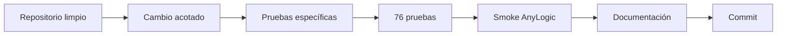

<div align="center">

# Contribuir a Pedemonte Digital Twin

[Inicio](README.md) ·
[Documentación](docs/README.md) ·
[Diseño](docs/system-design.md) ·
[Calidad](docs/quality-and-experiments.md)

</div>

---

> [!IMPORTANT]
> El repositorio combina AnyLogic, Python, datos operativos y un checkpoint RL. Un cambio aparentemente pequeño puede afectar la reproducibilidad de todos los métodos.

## Flujo mínimo



## Convención de commits

Se utiliza Conventional Commits con títulos en inglés:

```text
feat: add GIS truck follow controls
fix: correct strict cache validation
refactor: simplify planner selector
docs: improve repository navigation
test: cover hybrid fallback behavior
chore: update development dependencies
```

No incluir números de fase, versiones temporales ni etiquetas como `final`.

## Antes de modificar

```powershell
git status --short
```

El repositorio debe estar limpio. Después activar el entorno:

```powershell
.\.venv\Scripts\Activate.ps1
```

## Cambios Python

Desde `python/`:

```powershell
$py = (Resolve-Path "..\.venv\Scripts\python.exe").Path

& $py -m compileall -q planner scripts tests
& $py -m pytest -q --tb=short
```

Cada método nuevo debe:

- devolver un `PlanTurno`;
- respetar capacidad, split, ventanas y volcador;
- usar el proveedor vial inyectado;
- evaluarse con la función objetivo común;
- validar el plan antes de devolverlo;
- ser reproducible cuando corresponda;
- incorporar pruebas.

## Cambios AnyLogic

Antes del commit:

1. Ejecutar **Build Model**.
2. Probar importación Excel.
3. Probar RL y HÍBRIDO si cambia la integración.
4. Verificar textos visibles del dashboard.
5. Probar <kbd>General</kbd>, <kbd>Camión 0</kbd> y <kbd>Camión 1</kbd> si cambia el GIS.
6. Revisar `git diff --stat`.

> [!WARNING]
> `pyCommunicator.pythonExecPath` contiene una ruta absoluta específica de cada equipo. Revisar el diff para no mezclar un cambio local de ruta con cambios funcionales.

## Checkpoint RL

Los entrenamientos se guardan en:

```text
python/rl_artifacts/
```

No reemplazan automáticamente:

```text
python/models/rl/rl_policy.zip
python/models/rl/rl_policies.json
```

Una promoción requiere validación, hash, manifiesto, suite completa y pruebas RL/HÍBRIDO.

## Caché vial

No cambiar:

```text
python/data/routing/cache_vial.csv
```

sin ejecutar las pruebas de routing y una regresión de los cinco métodos. Producción usa caché estricta y no acepta fallback silencioso.

## Archivos no versionados

Entre otros:

```text
.venv/
python/results/
python/rl_artifacts/
__pycache__/
.pytest_cache/
anylogic/**/al_uploads/
```

No versionar resultados temporales, planillas locales, backups del `.alp` ni checkpoints candidatos.

---

<div align="center">

<a href="docs/development-and-deployment.md">Flujo de desarrollo completo →</a>

</div>
