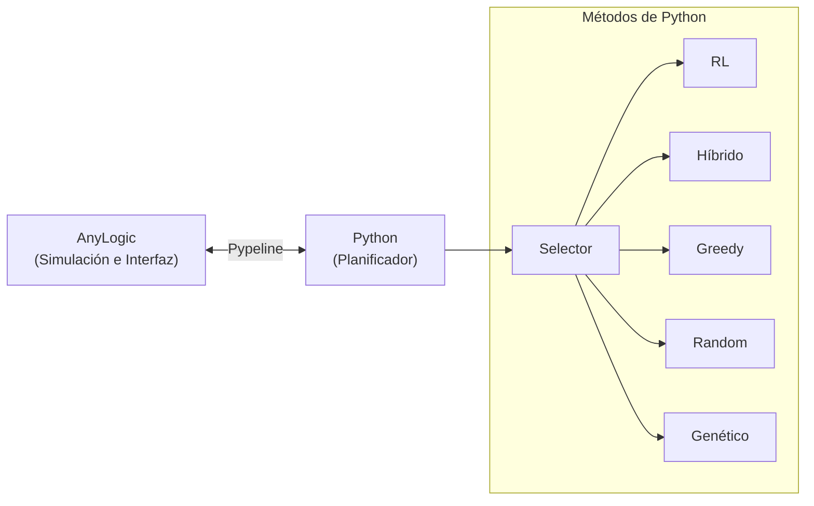

<div align="center">

# Pedemonte Digital Twin

**Gemelo digital logístico impulsado por Aprendizaje por Refuerzo (RL)**  
Planificación inteligente, simulación operativa interactiva y seguimiento GIS para operaciones de reparto.

<p>
  
  
  
</p>

[🚀 Comenzar](docs/getting-started.md) •
[📚 Documentación](docs/README.md) •
[🎛️ Manual](docs/user-manual.md) •
[🏗️ Arquitectura](docs/system-design.md)

</div>

---

Pedemonte Digital Twin es un entorno que permite preparar pedidos, generar planes de reparto eficientes, ejecutar la simulación del turno y realizar un seguimiento de los camiones mediante mapas (GIS). 

El corazón del planificador es una política productiva única de **Aprendizaje por Refuerzo (RL)**, complementada con métodos tradicionales para asegurar comparabilidad y factibilidad en todo momento.

> [!IMPORTANT]
> El entorno soportado actualmente es **AnyLogic de escritorio integrado con Python local mediante Pypeline**.  
> *AnyLogic Cloud*, una *interfaz HTML web* y *visualización urbana 3D* no tienen soporte actualmente y quedan definidos como posibles trabajos futuros.

## 🌟 Características Principales

| 🧠 Planificación Inteligente | 🚚 Simulación Operativa | 🗺️ Seguimiento GIS |
| :--- | :--- | :--- |
| • **RL**: Propuesta principal<br>• **Híbrido (RL→GA)**: Refinamiento<br>• **Baselines**: Greedy, Random, GA<br>• Función objetivo unificada<br>• Máscara temporal dura | • 2 camiones activos (8 uds. c/u)<br>• Turnos definidos (mañana/tarde)<br>• Split automático de pedidos<br>• Tolerancia operativa (15 min)<br>• Reglas estrictas de volcador | • Vista de operación general<br>• Seguimiento de Camión 0 y 1<br>• Escala urbana exacta (1:10000)<br>• Caché vial estricta<br>• Rutas interactivas |

## 🏗️ Arquitectura del Sistema



1. **AnyLogic** prepara la instancia con los pedidos (manuales o por Excel) y la envía a Python.
2. **Python** genera un plan factible usando el método seleccionado y calcula su costo.
3. El plan retorna a **AnyLogic**, donde se simula con tiempos de tráfico reales y disponibilidad de recursos.

## 🚀 Inicio Rápido

Para una guía detallada, consultá los [Primeros Pasos](docs/getting-started.md).

<details>
<summary><strong>1. Preparar el entorno Python</strong></summary>

Se recomienda el uso de PowerShell en la raíz del repositorio:
```powershell
py -3.11 -m venv .venv
.\.venv\Scripts\Activate.ps1
python -m pip install -r .\python\requirements-dev.txt
```
</details>

<details>
<summary><strong>2. Ejecutar suite de pruebas</strong></summary>

```powershell
Set-Location .\python
$py = (Resolve-Path "..\.venv\Scripts\python.exe").Path
& $py -m pytest -q --tb=short
```
</details>

<details>
<summary><strong>3. Configurar y Ejecutar AnyLogic</strong></summary>

1. Abrí el modelo `anylogic/PedemonteDigitalTwin_v2/PedemonteDigitalTwin_v2.alp`.
2. En el objeto `pyCommunicator` del agente `Main`, configurá `pythonExecPath` apuntando a tu ejecutable local (ej. `<ruta-absoluta>\.venv\Scripts\python.exe`).
3. Compilá el modelo (**Build Model**) y ejecutalo.
4. Cargá pedidos, prepará la operación, elegí **RL** como método y pulsá **Generar y ejecutar plan**.
</details>

## 📚 Mapa de Documentación

La documentación completa se encuentra en la carpeta `docs/`. Podés empezar por el [Índice de Documentación](docs/README.md) o ir directo a la sección que necesites:

- **[🚀 Primeros pasos](docs/getting-started.md)**: Instalación y configuración inicial.
- **[🎛️ Manual de uso](docs/user-manual.md)**: Cómo operar el dashboard, cargar Excels y leer las métricas.
- **[🏗️ Diseño del sistema](docs/system-design.md)**: Arquitectura profunda, rol de RL y métodos de planificación.
- **[🧪 Calidad y experimentos](docs/quality-and-experiments.md)**: Suite de regresión, reproducibilidad y validación.
- **[🛠️ Desarrollo y despliegue](docs/development-and-deployment.md)**: Decisiones técnicas, trabajo futuro y despliegue.

## 📊 Estado Actual del Proyecto

- **Terminado (✅)**: Integración Python-AnyLogic, política RL productiva, Híbrido RL→GA, GIS 2D, Caché vial estricta, suite de 76 pruebas.
- **Pendiente (🟡)**: Comparación experimental definitiva.
- **Fuera de alcance temporal (⚪)**: AnyLogic Cloud, Plugin HTML web, Vista urbana 3D.

## 👥 Integrantes

|                                                    Avatar                                                    | Nombre Completo                   |                                                         Perfil de GitHub                                                          |
| :----------------------------------------------------------------------------------------------------------: | :-------------------------------- | :-------------------------------------------------------------------------------------------------------------------------------: |
|     | Carlos Ricardo Gugliermino Zuñiga |   [](https://github.com/carlex74)   |
|  | Nicolás Pedemonte                 | [](https://github.com/NiconiKImg) |
|        | Luca Trincavelli                  |    [](https://github.com/LucaTvl)    |
|   | Franco Zariaga                    | [](https://github.com/Frasquito3) |
