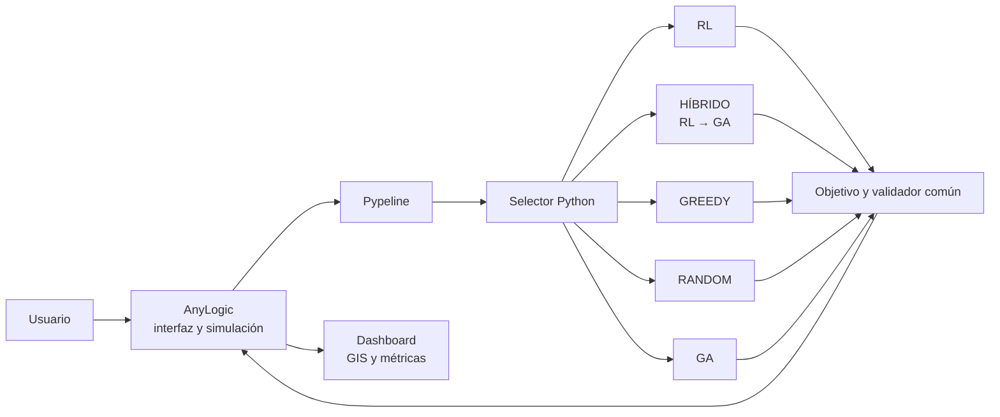

<div align="center">

# Pedemonte Digital Twin

### Planificación inteligente, simulación operativa y seguimiento GIS de repartos

<p>
  
  
  
  
</p>

<p>
  
  
  
  
</p>

**Gemelo digital para preparar, planificar, ejecutar y analizar la operación logística de Pedemonte.**

[Comenzar](docs/getting-started.md) ·
[Manual de uso](docs/user-manual.md) ·
[Diseño del sistema](docs/system-design.md) ·
[Calidad y experimentos](docs/quality-and-experiments.md) ·
[Documentación completa](docs/README.md)

</div>

---

> [!IMPORTANT]
> El entorno soportado actualmente es **AnyLogic de escritorio + Python local + Pypeline**.  
> AnyLogic Cloud, la interfaz HTML externa y una vista urbana 3D permanecen como trabajo futuro.

## El proyecto de un vistazo

<table>
<tr>
<td width="50%" valign="top">

### 🧠 Planificación inteligente

- Política RL productiva única.
- Máscara temporal dura.
- Refinamiento HÍBRIDO RL→GA.
- GREEDY, RANDOM y GA como referencias.
- Una función objetivo común.

</td>
<td width="50%" valign="top">

### 🚚 Simulación operativa

- Dos camiones activos.
- Capacidad de ocho unidades.
- Split automático de pedidos.
- Reglas de volcador.
- Ventanas horarias y tolerancia final.

</td>
</tr>
<tr>
<td width="50%" valign="top">

### 🗺️ Seguimiento GIS

- Vista general.
- Seguimiento del Camión 0.
- Seguimiento del Camión 1.
- Rutas activas y estados.
- Escala urbana 1:10000.

</td>
<td width="50%" valign="top">

### ✅ Reproducibilidad

- Caché vial estricta.
- Checkpoint RL validado por hash.
- Semillas registradas.
- 76 pruebas esenciales.
- Auditoría técnica productiva.

</td>
</tr>
</table>

## Arquitectura



AnyLogic prepara la instancia y ejecuta la operación. Python genera un plan factible usando el método seleccionado. El plan vuelve al modelo, se valida y se simula con recursos, tiempos, rutas y métricas operativas.

## Métodos disponibles

| Método | Función dentro del proyecto |
|---|---|
| **RL** | Propuesta principal. Utiliza una política única con máscara temporal dura. |
| **HÍBRIDO** | Parte del plan RL y permite que GA lo sustituya solamente si obtiene una mejora válida. |
| **GREEDY** | Baseline determinista, interpretable y factible. |
| **RANDOM** | Baseline aleatorio factible y reproducible mediante semilla. |
| **GA** | Búsqueda evolutiva evaluada con la función objetivo compartida. |

> [!NOTE]
> RL ocupa el lugar central del proyecto, pero la comparación debe ser honesta. Los resultados no deben afirmar que RL siempre supera a todos los métodos.

## Inicio rápido

<details>
<summary><strong>1. Crear el entorno Python</strong></summary>

Desde la raíz del repositorio:

```powershell
py -3.11 -m venv .venv
.\.venv\Scripts\Activate.ps1

python -m pip install --upgrade pip
python -m pip install -r .\python\requirements-dev.txt
```

</details>

<details>
<summary><strong>2. Ejecutar la regresión</strong></summary>

```powershell
Set-Location .\python

$py = (Resolve-Path "..\.venv\Scripts\python.exe").Path

& $py -m compileall -q planner scripts tests
& $py -m pytest -q --tb=short
```

Resultado esperado:

```text
76 passed
```

</details>

<details>
<summary><strong>3. Configurar AnyLogic</strong></summary>

Abrir:

```text
anylogic/PedemonteDigitalTwin_v2/PedemonteDigitalTwin_v2.alp
```

En `pyCommunicator`, actualizar `pythonExecPath`:

```text
<raíz-del-repositorio>\.venv\Scripts\python.exe
```

Después ejecutar **Build Model**.

</details>

<details>
<summary><strong>4. Ejecutar una operación</strong></summary>

1. Iniciar la simulación.
2. Cargar pedidos manualmente o desde `.xlsx`.
3. Pulsar <kbd>Preparar operación</kbd>.
4. Seleccionar un método.
5. Pulsar <kbd>Generar y ejecutar plan</kbd>.
6. Cambiar entre <kbd>General</kbd>, <kbd>Camión 0</kbd> y <kbd>Camión 1</kbd>.
7. Revisar el resultado de planificación y las métricas finales.

</details>

## Estado actual

| Componente | Estado |
|---|:---:|
| Modelo operativo AnyLogic | ✅ |
| Integración AnyLogic–Python | ✅ |
| Política RL única | ✅ |
| HÍBRIDO RL→GA | ✅ |
| Caché vial estricta | ✅ |
| Dashboard y GIS 2D | ✅ |
| Suite de regresión | ✅ 76/76 |
| Comparación experimental definitiva | 🟡 Pendiente |
| AnyLogic Cloud | ⚪ Experimental |
| Plugin HTML | ⚪ Pospuesto |
| Vista urbana 3D | ⚪ Pospuesta |

## Estructura

```text
PedemonteDigitalTwin_v2/
├── anylogic/
│   └── PedemonteDigitalTwin_v2/
│       └── PedemonteDigitalTwin_v2.alp
├── docs/
│   ├── README.md
│   ├── getting-started.md
│   ├── system-design.md
│   ├── user-manual.md
│   ├── quality-and-experiments.md
│   └── development-and-deployment.md
├── python/
│   ├── data/
│   ├── models/
│   ├── planner/
│   ├── scripts/
│   ├── tests/
│   ├── requirements-rl.txt
│   └── requirements-dev.txt
├── CONTRIBUTING.md
└── README.md
```

## Archivos productivos

```text
anylogic/PedemonteDigitalTwin_v2/PedemonteDigitalTwin_v2.alp
python/models/rl/rl_policy.zip
python/models/rl/rl_policies.json
python/data/routing/cache_vial.csv
python/data/processed/demanda_geografica.csv
```

## Documentación

<table>
<tr>
<td width="33%" valign="top">

### 🚀 Primeros pasos
Instalación, dependencias, Pypeline y primera ejecución.

[Leer guía →](docs/getting-started.md)

</td>
<td width="33%" valign="top">

### 🏗️ Diseño del sistema
Arquitectura, AnyLogic, Python, métodos, RL, routing y datos.

[Explorar diseño →](docs/system-design.md)

</td>
<td width="33%" valign="top">

### 🎛️ Manual operativo
Pedidos, Excel, dashboard, GIS y solución de problemas.

[Abrir manual →](docs/user-manual.md)

</td>
</tr>
<tr>
<td width="33%" valign="top">

### 🧪 Calidad
Pruebas, auditoría, metodología experimental y métricas.

[Ver calidad →](docs/quality-and-experiments.md)

</td>
<td width="33%" valign="top">

### 🛠️ Desarrollo
Flujo de cambios, decisiones, despliegue y trabajo futuro.

[Ver desarrollo →](docs/development-and-deployment.md)

</td>
<td width="33%" valign="top">

### 📚 Centro documental
Mapa de navegación y recorridos recomendados.

[Ir a documentación →](docs/README.md)

</td>
</tr>
</table>

---

<div align="center">

**Pedemonte Digital Twin** · AnyLogic · Python · RL · GIS

</div>
