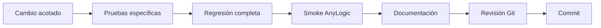

<div align="center">

# Desarrollo y despliegue

<a href="../README.md">🏠 Inicio</a> ·
<a href="README.md">📚 Documentación</a> ·
<a href="getting-started.md">🚀 Comenzar</a> ·
<a href="system-design.md">🏗️ Sistema</a> ·
<a href="user-manual.md">🎛️ Operación</a> ·
<a href="quality-and-experiments.md">🧪 Calidad</a> ·
<strong>🛠️ Desarrollo</strong>

</div>

---

## Flujo de desarrollo



### Cambio Python

1. Modificar.
2. Compilar.
3. Ejecutar pruebas específicas.
4. Ejecutar 76 pruebas.
5. Probar AnyLogic si afecta integración.
6. Actualizar documentación.
7. Confirmar.

### Cambio AnyLogic

1. Modificar desde el editor.
2. Guardar.
3. Build Model.
4. Ejecutar el flujo afectado.
5. Revisar interfaz y consola.
6. Ejecutar Python si afecta integración.
7. Confirmar solo cambios esperados.

### Cambio vial

1. Modificar o regenerar caché.
2. Conservar esquema.
3. Actualizar versión si cambia el contrato.
4. Ejecutar pruebas de routing.
5. Verificar misses.
6. Ejecutar los cinco métodos.
7. Actualizar huellas.

### Cambio de checkpoint

1. Entrenar en `rl_artifacts`.
2. Evaluar.
3. Comparar.
4. Promover manualmente.
5. Actualizar hash.
6. Actualizar manifiesto.
7. Ejecutar suite.
8. Ejecutar RL y HÍBRIDO.
9. Documentar la decisión.

## Revisión Git

```powershell
git status --short
git diff --stat
```

No confirmar:

```text
python/results/
python/rl_artifacts/
__pycache__/
.pytest_cache/
planillas locales
backups del .alp
checkpoints candidatos
```

## Decisiones técnicas

<table>
<tr>
<td width="50%" valign="top">

### Política RL única

Producción usa un manifiesto y un checkpoint. Reduce complejidad y permite auditar un único hash.

### Caché vial estricta

Un tramo faltante genera error. No se permite cambiar de fuente silenciosamente.

### Máscara temporal dura

La inferencia productiva exige acciones temporalmente válidas.

</td>
<td width="50%" valign="top">

### RL como propuesta central

GREEDY, RANDOM y GA son métodos de comparación. HÍBRIDO refina una semilla RL.

### Escritorio con Pypeline

La arquitectura soportada ejecuta Python local desde AnyLogic.

### Seguimiento GIS por cámara

Las vistas modifican el mapa, no el movimiento de los camiones.

</td>
</tr>
</table>

## Despliegue

### Soportado

```text
AnyLogic de escritorio
        +
Python local en .venv
        +
Pypeline
        +
archivos locales
```

Dependencias:

- ejecutable Python;
- paquete `planner`;
- checkpoint;
- manifiesto;
- caché;
- sistema de archivos.

### AnyLogic Cloud

> [!CAUTION]
> El proyecto actual no puede considerarse compatible con AnyLogic Cloud.

Motivos:

- Pypeline apunta a un ejecutable local;
- Python importa módulos locales;
- el checkpoint se lee desde disco;
- la caché se lee desde disco;
- no existe una API remota del planificador.

Publicar solamente el `.alp` no reproduce la arquitectura local.

### Alternativas futuras

#### API externa

```text
AnyLogic Cloud → HTTP API → planificador Python
```

Requiere:

- servicio desplegado;
- autenticación;
- serialización;
- timeout;
- persistencia;
- pruebas de red.

#### Portar a Java

Evita Python local, pero implica reimplementar algoritmos o exportar la inferencia.

#### Python como cliente de Cloud

Python podría controlar un modelo remoto. Cambia la dirección de integración y no conserva el dashboard como aplicación autónoma.

## Trabajo futuro

### Interfaz HTML

Objetivos:

- formulario alternativo;
- selección de coordenadas sobre un mapa.

Debe integrarse mediante un contrato versionado y una rama aislada.

### Vista 3D

Posible prototipo:

- camiones 3D;
- rutas simplificadas;
- cámaras;
- edificios simbólicos.

No es parte del camino crítico.

### Evolución operativa

- calibrar proveedores;
- evaluar el tercer camión de respaldo;
- actualizar demanda;
- ampliar caché;
- reentrenar;
- completar comparación experimental.

## Glosario

| Término | Significado |
|---|---|
| Pedido original | Pedido antes del split. |
| Tarea | Parte planificable posterior al split. |
| Viaje | Salida, entregas y regreso. |
| Volcador | Condición que obliga a cerrar el viaje. |
| Ventana | Intervalo permitido por el cliente. |
| Tardanza | Minutos posteriores a la ventana. |
| Tolerancia final | Margen para finalizar el turno; no amplía ventanas. |
| Caché vial | Matriz persistente de tramos dirigidos. |
| Fallback | Fuente alternativa; deshabilitada en producción. |
| Checkpoint | Archivo de parámetros RL. |
| Manifiesto | JSON que identifica y valida el checkpoint. |
| HÍBRIDO | RL genera semilla y GA intenta mejorarla. |
| Pypeline | Puente entre AnyLogic y Python local. |

## Convención de commits

```text
feat:
fix:
refactor:
docs:
test:
chore:
```

Ejemplo:

```text
docs: redesign repository documentation
```

---

<div align="center">

<a href="quality-and-experiments.md">← Calidad y experimentos</a>
&nbsp;·&nbsp;
<a href="README.md">Índice documental</a>
&nbsp;·&nbsp;
<a href="../README.md">Volver al inicio →</a>

</div>
