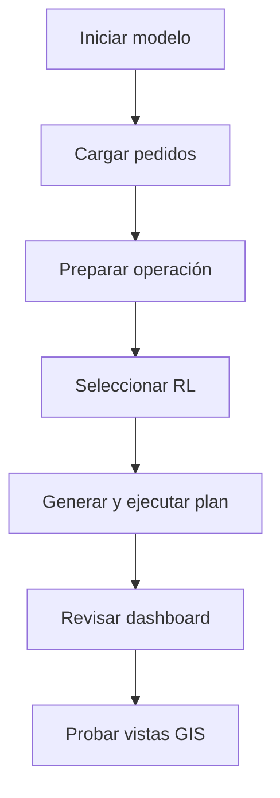

<div align="center">

# Primeros pasos

<a href="../README.md">🏠 Inicio</a> ·
<a href="README.md">📚 Documentación</a> ·
<strong>🚀 Comenzar</strong> ·
<a href="system-design.md">🏗️ Sistema</a> ·
<a href="user-manual.md">🎛️ Operación</a> ·
<a href="quality-and-experiments.md">🧪 Calidad</a> ·
<a href="development-and-deployment.md">🛠️ Desarrollo</a>

</div>

---

## Requisitos

| Componente | Recomendación verificada |
|---|---|
| Sistema operativo | Windows |
| Terminal | PowerShell |
| Python | 3.11 |
| AnyLogic | Personal Learning Edition |
| Integración | Pypeline |
| Control de versiones | Git |

Paquetes principales del entorno validado:

```text
Python 3.11.9
anylogic-alpyne 1.2.0
gymnasium 1.3.0
stable-baselines3 2.9.0
sb3-contrib 2.9.0
numpy 2.4.6
openpyxl 3.1.5
pytest 9.1.1
```

## Instalación

### 1. Clonar y entrar al repositorio

```powershell
git clone <URL-DEL-REPOSITORIO>
Set-Location .\PedemonteDigitalTwin_v2
```

### 2. Crear el entorno virtual

```powershell
py -3.11 -m venv .venv
.\.venv\Scripts\Activate.ps1

python -m pip install --upgrade pip
python -m pip install -r .\python\requirements-dev.txt
```

> [!TIP]
> Si ya estás dentro de la carpeta `python`, la ruta correcta es:
>
> ```powershell
> python -m pip install -r .\requirements-dev.txt
> ```

### 3. Verificar archivos productivos

```powershell
$required = @(
    ".\python\models\rl\rl_policy.zip",
    ".\python\models\rl\rl_policies.json",
    ".\python\data\routing\cache_vial.csv",
    ".\python\data\processed\demanda_geografica.csv"
)

$required | ForEach-Object {
    "{0}: {1}" -f $_, (Test-Path $_)
}
```

Todos deben devolver `True`.

### 4. Verificar el checkpoint

```powershell
Get-FileHash `
    ".\python\models\rl\rl_policy.zip" `
    -Algorithm SHA256
```

Hash esperado:

```text
7d2838963f578656919822ee258e9c87c38257829ea801bbd3b41fcf26d20da4
```

## Regresión Python

```powershell
Set-Location .\python

$py = (Resolve-Path "..\.venv\Scripts\python.exe").Path

& $py -m compileall -q planner scripts tests
& $py -m pytest -q --tb=short
```

Resultado esperado:

```text
76 passed
```

## Configurar AnyLogic

Abrir:

```text
anylogic/PedemonteDigitalTwin_v2/PedemonteDigitalTwin_v2.alp
```

### Pypeline

En `Main`, seleccionar `pyCommunicator` y configurar:

```text
pythonCommandType: PYTHON_PATH
pythonExecPath: <raíz>\.venv\Scripts\python.exe
```

> [!WARNING]
> `pythonExecPath` es una ruta absoluta. Cada integrante debe actualizarla en su equipo.

### Resolución del paquete Python

El modelo busca la carpeta `python` mediante:

1. propiedad Java `pedemonte.python.root`;
2. variable `rutaPythonProyectoPypeline`;
3. búsqueda ascendente desde `user.dir`.

La carpeta válida debe contener:

```text
planner/
pyrefly.toml
```

En una copia normal del repositorio no es necesario configurar manualmente la raíz.

### Compilar

Ejecutar:

```text
Build Model
```

No iniciar una simulación con errores de compilación.

## Primera ejecución



Pasos:

1. Iniciar el modelo.
2. Cargar una planilla `.xlsx` o pedidos manuales.
3. Pulsar <kbd>Preparar operación</kbd>.
4. Seleccionar `RL`.
5. Pulsar <kbd>Generar y ejecutar plan</kbd>.
6. Confirmar que el panel termine en `FINALIZADO`.
7. Probar <kbd>General</kbd>, <kbd>Camión 0</kbd> y <kbd>Camión 1</kbd>.

## Analizador de tipos

Desde `python/`:

```powershell
$py = (Resolve-Path "..\.venv\Scripts\python.exe").Path
& $py -m pyrefly check
```

`python/pyrefly.toml` espera el entorno:

```text
../.venv/Scripts/python.exe
```

## Checklist

- [ ] `.venv` creado.
- [ ] Dependencias instaladas.
- [ ] Checkpoint y manifiesto presentes.
- [ ] Caché vial presente.
- [ ] 76 pruebas aprobadas.
- [ ] Ruta Pypeline actualizada.
- [ ] Build Model correcto.
- [ ] Primera ejecución finalizada.
- [ ] Tres vistas GIS probadas.

---

<div align="center">

<a href="README.md">← Centro documental</a>
&nbsp;·&nbsp;
<a href="system-design.md">Diseño del sistema →</a>

</div>
