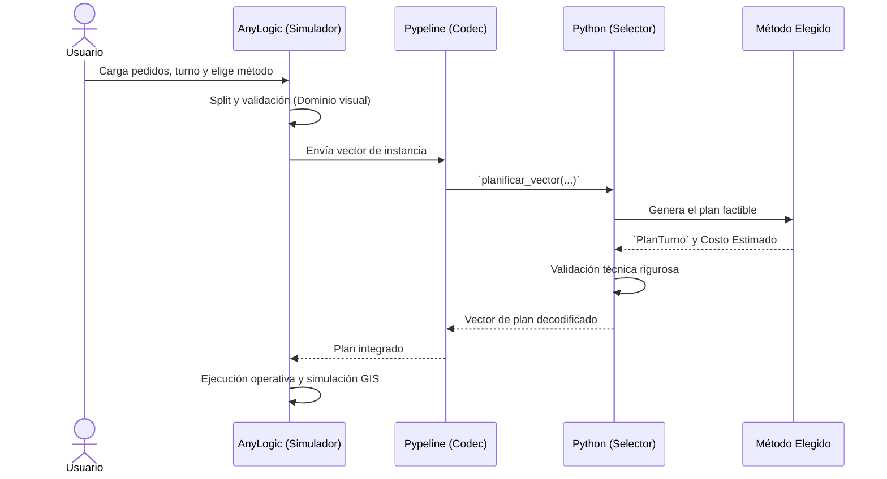

# 🏗️ Diseño del Sistema

[🏠 Inicio](../README.md) •
[📚 Documentación](README.md) •
[🚀 Comenzar](getting-started.md) •
**🏗️ Sistema** •
[🎛️ Operación](user-manual.md) •
[🧪 Calidad](quality-and-experiments.md) •
[🛠️ Desarrollo](development-and-deployment.md)

---

Pedemonte Digital Twin separa limpiamente la interfaz interactiva y la simulación operativa (AnyLogic) de la lógica de optimización y algoritmos complejos (Python). Esta separación permite la escalabilidad del agente RL y facilita las pruebas automatizadas.

## 📐 Arquitectura General

### División de Responsabilidades

| AnyLogic | Python |
| :--- | :--- |
| • Formulario de importación de Excel • Split visual y generación de la instancia • Simulación de camiones y trabajadores • Vista GIS y rutas urbanas • Cálculo de métricas operativas reales | • Algoritmos: RL, GA, Greedy, Random • Matriz vial matemática (Caché Estricta) • Cálculo de Función Objetivo (Determinista) • Validador de factibilidad • Codecs de integración con Pypeline |

---

## 🧠 Algoritmos de Planificación

El corazón de la solución, y la propuesta central del proyecto, es el algoritmo de **Aprendizaje por Refuerzo (RL)**. Sin embargo, el entorno implementa una serie de alternativas (Baselines) para garantizar la robustez matemática, la comparabilidad y mantener opciones de respaldo factibles.

### 1. Política Única de RL
- Inferencia determinista a través de una **máscara temporal dura**.
- Representa la inteligencia primaria del sistema. La máscara impide que RL tome acciones inviables (ej. enviar un camión fuera de la ventana del cliente).

### 2. Refinamiento Híbrido (RL → GA)
El modo Híbrido combina la heurística veloz de RL con el poder de exploración local de los algoritmos genéticos:
- **Flujo:** `Instancia → RL (Semilla Factible) → GA → Mejora`
- Si el GA no encuentra un costo mejor que el generado por RL, el sistema **descarta** la solución de GA y conserva la propuesta original de RL.

### 3. Baselines de Referencia
- **Greedy:** Enfoque determinista que prioriza siempre la ventana de tiempo, disponibilidad cercana de camiones y capacidad de carga. Es factible e interpretable.
- **Random:** Utilizado estrictamente para comprobación de regresiones matemáticas; mezcla de manera reproducible mediante una semilla, asegurando rutas válidas pero ineficientes.
- **Algoritmo Genético (GA):** Búsqueda evolutiva independiente. Útil para observar cómo se comporta la función objetivo si no parte del *warm-start* de RL.

---

## 🎯 Función Objetivo Compartida

Independientemente del método elegido, todos los planes se miden contra una **única** función objetivo (en Python) que estima penalizaciones, costos de distancias y minutos. 

| Componente Penalizado | Peso Estándar |
| :--- | :--- |
| Tarea no entregada | 10000 |
| Pedido original incompleto | 5000 |
| Minuto por encima de tolerancia | 500 |
| Minuto de tardanza (Ventana) | 100 |
| Viaje adicional | 5 |
| Kilómetro recorrido | 2 |
| Minuto operativo base | 1 |
| Minuto de desbalance entre camiones | 0.5 |

> [!NOTE]
> El **Costo Estimado** generado por Python es determinista. El **Costo Real** final devuelto por AnyLogic variará ya que añade tiempos de tráfico micro-simulados y variables probabilísticas operativas menores.

---

## 🗺️ Caché Vial Estricta

Para mantener un comportamiento totalmente reproducible sin necesidad de consultar APIs de ruteo externas constantemente, el sistema utiliza una caché vial registrada en `python/data/routing/cache_vial.csv`.

- **Estricta:** Producción usa `permitir_fallback_vial=False`. Si un par (Origen, Destino) no existe en la matriz local, la planificación **falla** explícitamente.
- **Escala de Seguimiento (GIS):** AnyLogic utiliza una proporción estricta de `1.0 / 10000.0`. Esto altera visualmente el zoom pero no afecta matemáticamente las métricas.
