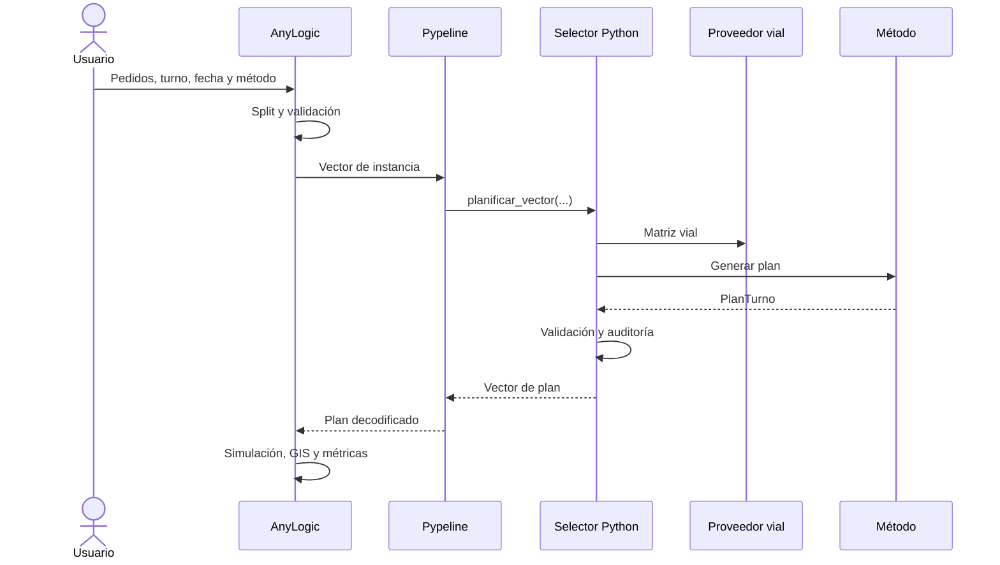

<div align="center">

# Diseño del sistema

<a href="../README.md">🏠 Inicio</a> ·
<a href="README.md">📚 Documentación</a> ·
<a href="getting-started.md">🚀 Comenzar</a> ·
<strong>🏗️ Sistema</strong> ·
<a href="user-manual.md">🎛️ Operación</a> ·
<a href="quality-and-experiments.md">🧪 Calidad</a> ·
<a href="development-and-deployment.md">🛠️ Desarrollo</a>

</div>

---

## Arquitectura

El sistema está dividido en dos procesos:



### Responsabilidad de AnyLogic

- interfaz;
- importación y formulario;
- construcción de la instancia;
- recursos y cronología real;
- camiones y trabajadores;
- proveedores;
- GIS y rutas;
- métricas de simulación;
- presentación del resultado.

### Responsabilidad de Python

- validación de estructuras;
- split y dominio;
- métodos de planificación;
- inferencia RL;
- refinamiento HÍBRIDO;
- matriz vial;
- estimación operativa;
- función objetivo;
- codecs de integración;
- pruebas.

## Modelo AnyLogic

Archivo:

```text
anylogic/PedemonteDigitalTwin_v2/PedemonteDigitalTwin_v2.alp
```

Agentes principales:

```text
Main
Camion
```

### Parámetros operativos

| Parámetro | Valor |
|---|---:|
| Capacidad por camión | 8 unidades |
| Camiones operativos | 2 |
| Empleados de corralón | 2 |
| Tolerancia final | 15 min |
| Turno mañana | 07:30–12:00 |
| Turno tarde | 14:00–17:00 |
| Corralón | -32.8495006, -60.722653 |

La tolerancia final evalúa la finalización operativa. No amplía las ventanas de los clientes.

### Split y volcador

Un pedido que supera la capacidad se divide en tareas. Todas las partes mantienen el ID original.

Si el pedido requiere volcador:

- todas sus partes heredan esa condición;
- cada parte debe cerrar su propio viaje.

### Recursos

Cada camión dispone de chofer. La carga puede usar empleados de corralón y, cuando corresponde, recursos liberados. Python replica esta política de manera determinista para estimar costos comparables.

## Planificador Python

```text
planner/
├── algorithms/
├── core/
├── domain/
├── integration/
├── rl/
└── routing/
```

| Módulo | Responsabilidad |
|---|---|
| `algorithms` | GREEDY, RANDOM, GA e HÍBRIDO |
| `core` | contratos, configuración y estructuras |
| `domain` | split y validación |
| `integration` | Excel, codecs y puente AnyLogic |
| `rl` | entorno, inferencia, recompensa y entrenamiento |
| `routing` | viajes, recursos, tiempos y objetivo |

Punto de entrada productivo:

```python
from planner.integration import selector_bridge
```

Funciones principales:

```python
selector_bridge.inicializar(...)
selector_bridge.planificar_vector(...)
```

## Métodos

### RL como propuesta central

Carga una única política productiva. La inferencia es determinista y utiliza máscara temporal dura.

### HÍBRIDO

```text
Instancia → RL → semilla factible → GA → comparación → plan final
```

Reglas:

- RL debe generar la semilla;
- GA intenta mejorarla;
- no se agrega GREEDY como semilla;
- GA sustituye RL solamente si mejora el costo;
- si GA falla, se conserva RL;
- si RL falla, el modo informa el error.

### GREEDY

Prioriza factibilidad, ventanas, capacidad, distancia y disponibilidad estimada. Es determinista e interpretable.

### RANDOM

Genera planes factibles mediante mezcla aleatoria reproducible. No usa costo ni distancia para optimizar.

### GA

Configuración base:

| Parámetro | Valor |
|---|---:|
| Población | 60 |
| Generaciones | 100 |
| Elite | 4 |
| Torneo | 3 |
| Crossover | 0.9 |
| Mutación swap | 0.2 |
| Mutación inversión | 0.1 |
| Máximo sin mejora | 30 |

## Función objetivo

Todos los métodos utilizan los mismos componentes:

- tareas no entregadas;
- pedidos originales incompletos;
- tardanza;
- exceso de tolerancia;
- duración operativa;
- distancia;
- viajes;
- desbalance de finalización.

Valores principales:

| Componente | Peso |
|---|---:|
| Tarea no entregada | 10000 |
| Pedido original incompleto | 5000 |
| Minuto de tardanza | 100 |
| Minuto sobre tolerancia | 500 |
| Minuto operativo | 1 |
| Kilómetro | 2 |
| Viaje | 5 |
| Minuto de desbalance | 0.5 |

## RL productivo

### Checkpoint productivo

```text
python/models/rl/rl_policies.json
python/models/rl/rl_policy.zip
```

Versión:

```text
pedemonte-rl-single-policy-v1
```

SHA-256:

```text
7d2838963f578656919822ee258e9c87c38257829ea801bbd3b41fcf26d20da4
```

El runtime comprueba el hash antes de cargar el modelo.

### Alcance validado

```text
Máximo validado: 12
Casos: 246
Casos sin riesgo: 231
Pedidos tardíos acumulados: 22
Tardanza total: 215.976763 min
```

Segmentos:

```text
3–8 pedidos: 124/124
9–10 pedidos: 55/60
11–12 pedidos: 50/60
```

La política es productiva, pero mantiene limitaciones documentadas en alta demanda.

### Máscara temporal dura

El manifiesto exige:

```json
"usar_mascara_temporal_dura": true
```

La máscara impide acciones temporalmente inviables según la estimación del estado. Desactivarla invalida la validación actual.

### Entrenamiento

Desde `python/`:

```powershell
$py = (Resolve-Path "..\.venv\Scripts\python.exe").Path

& $py scripts\training\train_rl_policy.py `
    --run-name policy_training
```

Desde cero:

```powershell
& $py scripts\training\train_rl_policy.py `
    --from-scratch `
    --run-name policy_training_from_scratch
```

Smoke:

```powershell
& $py scripts\training\train_rl_policy.py `
    --quick `
    --run-name policy_training_smoke
```

Los resultados se guardan en `python/rl_artifacts/` y nunca reemplazan automáticamente el checkpoint productivo.

## Rutas y GIS

### Caché vial

```text
python/data/routing/cache_vial.csv
```

Versión:

```text
pedemonte-vial-v1
```

Columnas:

```text
version_cache
lat_origen
lon_origen
lat_destino
lon_destino
distancia_metros
tiempo_base_min
fuente_distancia
fuente_tiempo
```

Producción usa:

```text
permitir_fallback_vial=False
```

Un tramo faltante detiene la planificación para evitar comparaciones con fuentes distintas.

### Tráfico

| Período | Factor |
|---|---:|
| 07:30–09:00 | 1.2 |
| 16:00–17:00 | 1.2 |
| Resto | 1.0 |

### Seguimiento GIS

| Modo | Valor interno |
|---|---:|
| General | -1 |
| Camión 0 | 0 |
| Camión 1 | 1 |

Escala:

```java
1.0 / 10000.0
```

El seguimiento cambia centro y escala del mapa. No modifica posición ni movimiento.

## Archivos productivos

```text
anylogic/PedemonteDigitalTwin_v2/PedemonteDigitalTwin_v2.alp
python/models/rl/rl_policy.zip
python/models/rl/rl_policies.json
python/data/routing/cache_vial.csv
python/data/processed/demanda_geografica.csv
```

## Formatos internos

AnyLogic serializa la instancia mediante:

```text
planner.integration.instance_vector_codec
```

El plan usa:

```text
planner.integration.alpyne_codec
```

Estos vectores son un protocolo interno, no una API pública para interfaces externas.

---

<div align="center">

<a href="getting-started.md">← Primeros pasos</a>
&nbsp;·&nbsp;
<a href="README.md">Índice</a>
&nbsp;·&nbsp;
<a href="user-manual.md">Manual de uso →</a>

</div>
