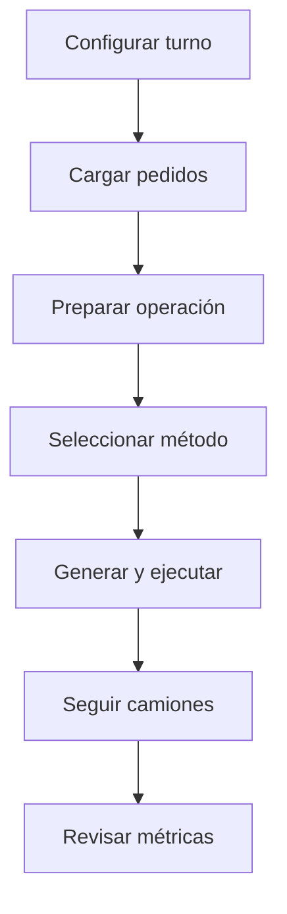

<div align="center">

# Manual de uso

<a href="../README.md">🏠 Inicio</a> ·
<a href="README.md">📚 Documentación</a> ·
<a href="getting-started.md">🚀 Comenzar</a> ·
<a href="system-design.md">🏗️ Sistema</a> ·
<strong>🎛️ Operación</strong> ·
<a href="quality-and-experiments.md">🧪 Calidad</a> ·
<a href="development-and-deployment.md">🛠️ Desarrollo</a>

</div>

---

## Preparar una operación



### 1. Turno

Completar:

- turno;
- fecha;
- semilla.

| Turno | Inicio | Fin |
|---|---:|---:|
| `MANANA` | 07:30 | 12:00 |
| `TARDE` | 14:00 | 17:00 |

### 2. Pedidos

#### Formulario manual

Campos:

- ID;
- cliente;
- dirección;
- barrio;
- unidades;
- latitud;
- longitud;
- volcador;
- ventana específica.

#### Planilla Excel

Solo `.xlsx`. Hoja preferida:

```text
Pedidos
```

Si no existe, se usa la hoja activa. El encabezado puede estar dentro de las primeras veinte filas.

### Columnas

| Campo normalizado | Encabezados aceptados |
|---|---|
| `pedido_id` | ID, Código, ID pedido |
| `unidades` | Unidades, Cantidad, Carga |
| `latitud` | Latitud, Lat |
| `longitud` | Longitud, Lon, Lng |
| `requiere_volcador` | Requiere volcador, Volcador |
| `tiene_ventana` | Tiene ventana, Ventana |
| `hora_desde` | Hora desde, Desde |
| `hora_hasta` | Hora hasta, Hasta |

Opcionales:

```text
cliente
direccion
barrio
observaciones
```

### Booleanos

Verdaderos:

```text
Sí, S, True, Verdadero, 1
```

Falsos:

```text
No, N, False, Falso, 0
```

### Horas

Se aceptan:

- hora Excel;
- `HH:mm`;
- minutos desde medianoche;
- fracción de día Excel.

### Validaciones

- ID obligatorio y único;
- unidades enteras mayores que cero;
- latitud entre -90 y 90;
- longitud entre -180 y 180;
- hora inicial menor que hora final;
- ventana dentro del turno;
- máximo técnico después del split.

El puente admite hasta 30 tareas. La política productiva fue validada hasta 12.

### 3. Preparar

Pulsar <kbd>Preparar operación</kbd>. Se ejecuta:

- consolidación;
- split;
- validación;
- actualización GIS;
- comprobación de caché vial.

### 4. Planificar

Seleccionar:

```text
RL
HIBRIDO
GREEDY
RANDOM
GA
```

Después pulsar <kbd>Generar y ejecutar plan</kbd>.

## Dashboard

<table>
<tr>
<td width="50%" valign="top">

### Configuración
Turno, fecha y semilla.

### Nuevo pedido
Carga manual y validaciones.

### Pedidos y operación
Resumen, importación, preparación y limpieza.

</td>
<td width="50%" valign="top">

### GIS
Corralón, clientes, rutas y camiones.

### Planificación
Método, costo estimado y resultado.

### Estado operativo
Camiones, pedidos y métricas finales.

</td>
</tr>
</table>

### Lenguaje visible

| Interno | Visible |
|---|---|
| `POLITICA_UNICA` | `RL` |
| `mascara_temporal=DURA` | `Restricciones horarias: ACTIVAS` |
| `PLAN_FINALIZADO` | `Plan finalizado` |
| `EN_CORRALON` | `En corralón` |

Los identificadores internos permanecen en la consola para auditoría.

### Resultado previsto y real

- **Costo estimado:** evaluación determinista de Python.
- **Costo real:** resultado de la simulación AnyLogic.

Pueden diferir porque la simulación incorpora variabilidad operativa.

### HÍBRIDO

Ejemplo:

```text
Plan inicial RL
Plan evaluado por GA
Mejora del costo
Resultado: GA mejoró el plan RL
```

`Método aplicado: GA` indica que el plan final provino de GA. Si no existe mejora, se conserva RL.

## Seguimiento GIS

| Botón | Resultado |
|---|---|
| <kbd>General</kbd> | Muestra la operación completa. |
| <kbd>Camión 0</kbd> | Sigue al primer camión. |
| <kbd>Camión 1</kbd> | Sigue al segundo camión. |

Cambiar la vista no altera rutas, estados ni métricas.

Escala de seguimiento:

```java
1.0 / 10000.0
```

## Estados

Ejemplos:

```text
En corralón
Cargando
Viajando a <pedido>
En cliente <pedido>
Regresando al corralón
Plan finalizado
```

El resumen de pedidos omite categorías cuyo valor es cero.

## Métricas finales

Aparecen solamente cuando la operación termina:

- tareas entregadas;
- tareas no entregadas;
- viajes;
- costo total.

La consola informa además:

- distancia;
- carga;
- viaje;
- espera;
- descarga;
- ocupación;
- tardanza;
- detalle por camión.

## Reiniciar

Usar <kbd>Limpiar operación</kbd> antes de cargar un escenario nuevo. No reutilizar una ejecución parcial.

## Solución de problemas

<details>
<summary><strong>Pypeline no inicia Python</strong></summary>

Revisar:

```text
pyCommunicator.pythonExecPath
```

Debe apuntar a:

```text
<repositorio>\.venv\Scripts\python.exe
```

Comprobar:

```powershell
Test-Path ".\.venv\Scripts\python.exe"
```

</details>

<details>
<summary><strong>No se encuentra la carpeta Python</strong></summary>

La carpeta debe contener:

```text
python/planner/
python/pyrefly.toml
```

Abrir AnyLogic desde una copia completa del repositorio. Como alternativa local, configurar `rutaPythonProyectoPypeline`.

</details>

<details>
<summary><strong>Checkpoint ausente o hash incorrecto</strong></summary>

```powershell
Test-Path ".\python\models\rl\rl_policy.zip"

Get-FileHash `
    ".\python\models\rl\rl_policy.zip" `
    -Algorithm SHA256
```

Hash esperado:

```text
7d2838963f578656919822ee258e9c87c38257829ea801bbd3b41fcf26d20da4
```

No entrenar automáticamente para reemplazar un checkpoint faltante.

</details>

<details>
<summary><strong>Cache miss estricto</strong></summary>

La instancia contiene un tramo no registrado. No habilitar fallback para ocultarlo. Ampliar la caché y ejecutar una regresión completa.

</details>

<details>
<summary><strong>La planilla se rechaza</strong></summary>

Revisar:

- extensión;
- encabezados;
- IDs duplicados;
- booleanos;
- horas;
- ventanas;
- coordenadas;
- cantidad de tareas tras el split.

</details>

<details>
<summary><strong>El mapa no muestra calles</strong></summary>

Las teselas pueden necesitar Internet. La ausencia visual de calles no implica necesariamente que la matriz vial local esté dañada.

</details>

<details>
<summary><strong>El seguimiento se ve demasiado cerca</strong></summary>

La escala correcta es:

```java
1.0 / 10000.0
```

`setMapScale()` recibe una proporción. No usar `10000.0`.

</details>

<details>
<summary><strong>Git muestra el .alp después de configurar Python</strong></summary>

La ruta absoluta está dentro del modelo. Revisar el diff para no confirmar un cambio local de ruta junto con modificaciones funcionales.

</details>

---

<div align="center">

<a href="system-design.md">← Diseño del sistema</a>
&nbsp;·&nbsp;
<a href="README.md">Índice</a>
&nbsp;·&nbsp;
<a href="quality-and-experiments.md">Calidad y experimentos →</a>

</div>
